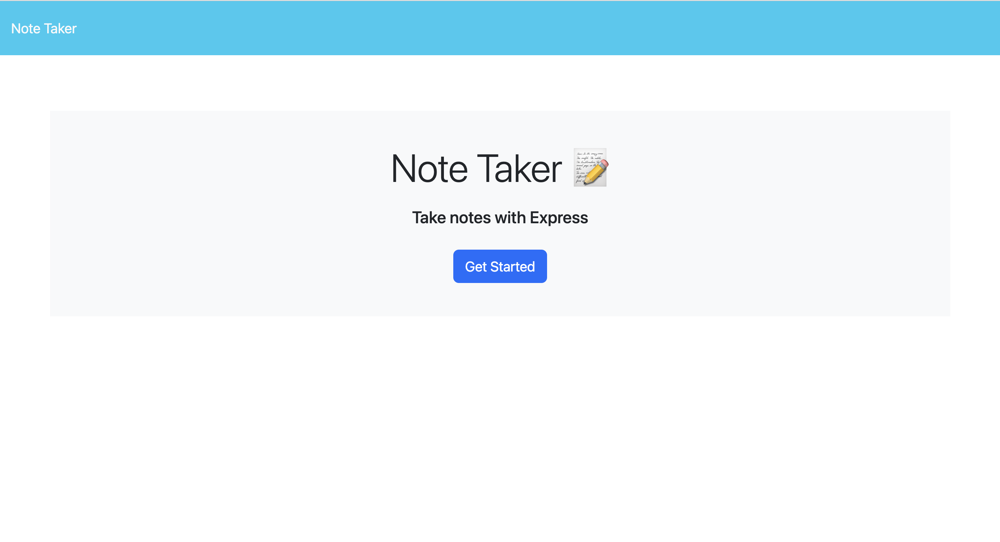
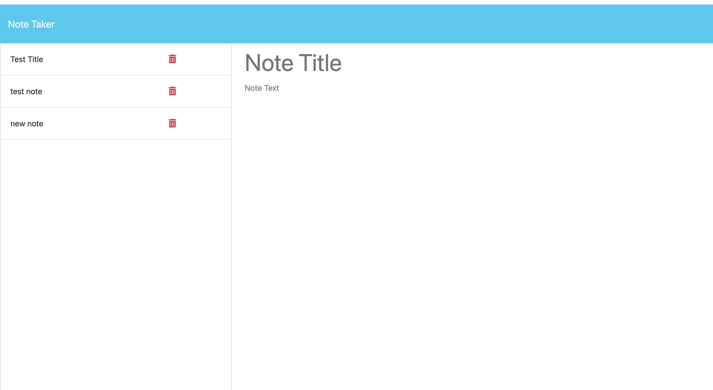

# NoteTaker

An application that allows the user to write and save notes.

## Use

when opening the application, the user will be presented with a headline page, and a get started button.
After Cicking the button the user will be able to create and save their note.

The user will not be presented with the save button until both the 'Note Title' and 'Note Text' fields are filled.

After clicking on the save button, the note will be saved to the left in the Note Taker list.

## Links

Githun repo - https://github.com/YuvNah/NoteTaker

Heroku - (will be added at a later date)

video Link (temporery) - https://drive.google.com/file/d/1olutyg9szZ66ZmAW2B08YpciLXR_mHjy/view
